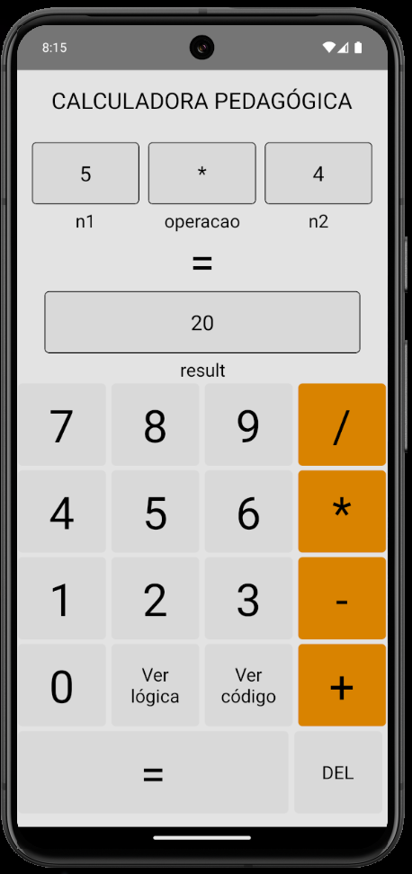
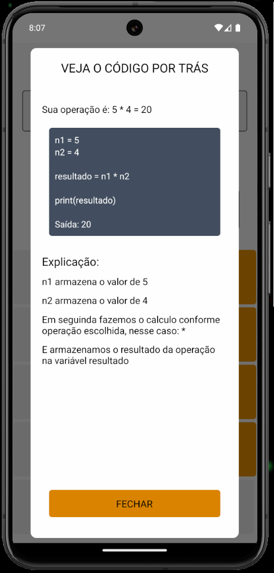

# Calculadora
Um projeto educativo e pedagógico, focado em ensinar lógica aritmética e computacional. Trata-se de uma calculadora desenvolvida especialmente para facilitar o aprendizado de alunos e interessados no tema.

## Funcionamento

O aplicativo possui três campos de entrada: no primeiro e terceiro, o usuário insere os números, enquanto no campo central escolhe a operação aritmética. Após preencher, basta clicar no botão "=" para realizar o cálculo, assim como em uma calculadora tradicional. 

O diferencial está nos botões adicionais: "Ver Lógica" e "Ver Código". Ao clicar em "Ver Lógica", um modal é aberto com uma explicação detalhada sobre a lógica matemática por trás da operação. Já o botão "Ver Código" exibe, também em um modal, o código-fonte em Python que demonstra como o resultado foi obtido. 

Essa abordagem torna o aprendizado mais interativo e intuitivo.

### Tela do Aplicativo

### Botão Ver Lógica
Exemplo utilizando **Multiplicação**.

### Botão Ver Código
Explica como é lógica por trás do código.

## Tecnologias utilizadas
### Python (Back-end)
O único requisito para este projeto era o uso de Python. Por isso, toda a lógica de cálculo foi implementada no back-end. O front-end é responsável por enviar requisições para o back-end, que processa os cálculos e retorna os resultados via HTTP.

### React Native (Front-end)
A interface gráfica foi desenvolvida utilizando React Native, que é responsável por todo o front-end da aplicação. O usuário interage com a interface, insere os dados e escolhe a operação desejada. Ao clicar no botão "=", uma requisição é enviada ao back-end, implementado em Python, que processa os cálculos e retorna o resultado.

### Amazon AWS (EC2 - Hospedagem)
Utilizei a AWS para hospedar o back-end em Python por meio do serviço EC2. O front-end realiza requisições HTTP para o back-end hospedado na AWS, que processa os dados e retorna os resultados diretamente para o front-end.

## Bibliotecas
### React Native
    npm install @react-navigation/native
    npm install @react-navigation/native @react-navigation/native-stack
    npm install react-native-screens react-native-safe-area-context
    npm install --save styled-components
### Python
    pip install Flask
    pip install Flask flask-cors
    pip install awscli awsebcli
### AWS
    sudo apt install nginx -y
    sudo apt install certbot python3-certbot-nginx -y

## Como rodar localmente (sem AWS)
- Instale todas as bibliotecas necessárias.
- Vá para a pasta **frontend**.
  - Entre da pasta **src**.
  - Execute o comando **npm run android**.
- Abra um novo terminal e vá para a pasta **backend**.
  - Entre na pasta **app**.
  - Execute o comando **python app.py**.
- Altere o **ip** dentro do arquivo **calcularResultado.ts** (que está dentro do frontend), caso necessário.

## Como rodar na AWS
- Criando uma instância na AWS.
  - Busque por **EC2**.
  - Crie uma Instância.
  - Dê nome a sua instância
  - Selecione a imagem do Sistema Operacional (eu utilizei o **Ubunto**).
  - Selecione o tipo de instância.
  - Caso não tiver um par de chaves, crie uma em formato **.ppk** e salve o arquivo em um local seguro.
  - Permita o tráfego em SSH, HTTPS e HTTP.
  - Crie a intância.
- Grupo de segurança.
  - Vá para o grupo de segurança.
  - **Editar regras de entrada**.
  - **Adionar regra**
  - **TCP personalizado**, e no intervalo de portas coloque a porta **5000**.
  - **Salvar regras**.
- Baixe o **Bitvise** na versão **Client** e abra.
  - Campo Username coloque o nome da máquina, nesse caso como eu usei o **Ubunto**, o nome será **ubunto**.
  - Campo Initial method, selecione **publickey**.
  - Importe sua chave **.ppk** para o Bitvise.
  - No campo Client key selecione a sua chave importada.
  - No Host coloque o seu Ip público da sua instância AWS.
  - Port: 22
  - E faça o Login.
  - Clique em **New SFTP**
  - Selecione a sua pasta que está o back-end
  - E arraste para dentro do seu serviço Ubunto.
  - Baixe o Python da máquina virtual.
  - Dentro da sua máquina Ubunto vá para o diretório. 
    - Exmemplo: **ls** mostra os diretórios e **cd** entra no diretório.
  - Dentro do diretório do back-end.
  -  Crie uma ambiente virtual no Python.
     -  **sudo apt install python3-venv**
     -  **python3 -m venv venv**
  -  Entre no ambiente virtual.
     - **source venv/bin/activate**
  -  instale as dependências necessárias
     - **pip install Flask**.
     - **pip install Flask flask-cors**.
     - **pip install awscli awsebcli**.
     - **pip install gunicorn**.
   - Execute o código Python dentro da AWS.
- No código Front-end
  - Pegue o Ip público da sua instância na AWS.
  - Altere o ip que está no arquivo **calcularResultado.ts** para o seu ip da instância.
  - Compile o aplicativo.